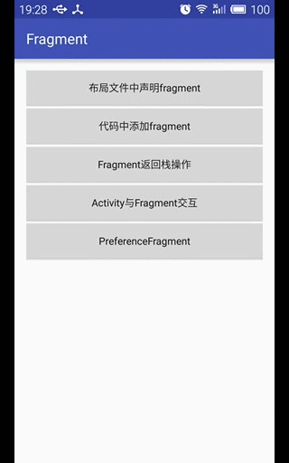
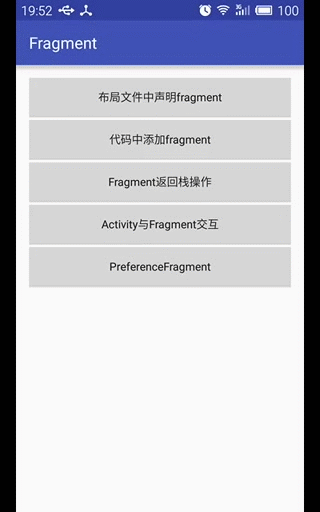
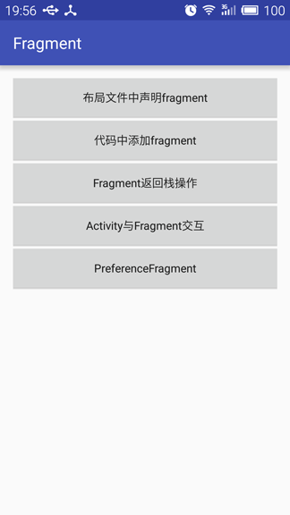

## Fragment

Fragment是Activity界面中的一部分或一种行为。可以使用多个Fragment组合到一个Activity中来创建一个多界面Activity，或者将一个Activity完整界面模块化成多个Fragment进行拼接。Fragment不能独立存在，它必须嵌入到Activity中，而且Fragment的生命周期直接受所在的Activity的影响。
在Activity中通过getFragmentManager()方法可以获取到FragmentManager对Fragment进行管理。

#### 将添加fragment到activity的两种方式

* 在Activity的布局文件中声明fragment组件，并指定name属性来绑定一个Fragment的子类

```xml
<?xml version="1.0" encoding="utf-8"?>
<LinearLayout xmlns:android="http://schemas.android.com/apk/res/android"
    android:id="@+id/activity_declare_fragment"
    android:orientation="vertical"
    android:layout_width="match_parent"
    android:layout_height="match_parent">

    <fragment
        android:id="@+id/frag_title"
        android:name="com.shellever.fragment.basic.TitleFragment"
        android:layout_width="match_parent"
        android:layout_height="0dp"
        android:layout_weight="1" />

    <fragment
        android:id="@+id/frag_content"
        android:name="com.shellever.fragment.basic.ContentFragment"
        android:layout_width="match_parent"
        android:layout_height="0dp"
        android:layout_weight="4" />
</LinearLayout>
```

查找声明在布局文件中的fragment视图组件的两种方式：

    1. 在布局文件中使用了`id`标签的，可以用`findFragmentById(int)`方法
    2. 在布局文件中使用了`tag`标签的，可以用`findFragmentByTag(String)`方法
    

* 通过代码实例化fragment并添加到`FrameLayout`(ViewGroup)中

```java
    // 获取Fragment管理器
    FragmentManager manager = getFragmentManager();

    // 通过管理器来启动一个Fragment事务
    FragmentTransaction transaction = manager.beginTransaction();

    // 添加一个Fragment
    ContentFragment fragment = new ContentFragment();
    transaction.add(R.id.fl_content, fragment);

    // 提交事务，使更改有效化
    transaction.commit();
```

#### fragment回退栈及传参的管理

FragmentTransaction类中的常用方法说明

|方法|说明|
|----|----|
|add()|添加一个fragment到Activity中|
|remove()|从Activity中移除一个已存在的fragment，若此fragment没有添加到回退栈，则会被直接销毁掉|
|replace()|替换当前的fragment，相当于remove()和add()的组合操作|
|hide()|隐藏当前的fragment，仅仅是不可见，并不会被销毁|
|show()|显示之前隐藏的fragment|
|commit()|提交一个事务，有效化更改|
|attach()|重建视图View，并附加到UI上进行显示|
|detach()|将视图View从UI中移除，和remove()不同，fragment的状态仍然由FragmentManager所维护|

**activity_back_task.xml**

布局文件中通过声明一个FrameLayout用于动态添加fragment

```xml
<?xml version="1.0" encoding="utf-8"?>
<LinearLayout xmlns:android="http://schemas.android.com/apk/res/android"
    xmlns:tools="http://schemas.android.com/tools"
    android:id="@+id/activity_back_task"
    android:layout_width="match_parent"
    android:layout_height="match_parent"
    android:orientation="vertical"
    tools:context="com.shellever.fragment.backtask.BackTaskActivity">

    <FrameLayout
        android:id="@+id/fl_content_tab"
        android:layout_width="match_parent"
        android:layout_height="0dp"
        android:layout_weight="1" />

    <LinearLayout
        android:layout_width="match_parent"
        android:layout_height="wrap_content"
        android:orientation="horizontal"
        android:padding="16dp">

        <Button
            android:id="@+id/btn_tab_home"
            android:layout_width="0dp"
            android:layout_height="wrap_content"
            android:layout_weight="1"
            android:text="Home"
            android:textAllCaps="false" />

        <Space
            android:layout_width="5dp"
            android:layout_height="wrap_content" />

        <Button
            android:id="@+id/btn_tab_settings"
            android:layout_width="0dp"
            android:layout_height="wrap_content"
            android:layout_weight="1"
            android:text="Settings"
            android:textAllCaps="false" />
    </LinearLayout>
</LinearLayout>
```

**TabContentFragment.java**

Fragment正确的传参方式是：使用一个静态工厂方法getInstance(String)，来返回一个fragment实例，在此方法中传进来的String类型参数，会先以键值对方式存放到Bundle中，然后在调用setArguments(Bundle)方法将其保存起来。使用参数时可以在onCreate(Bundle)事件中调用getArguments()方法来获取。

```java
package com.shellever.fragment.backtask;

import android.annotation.SuppressLint;
import android.app.Fragment;
import android.os.Bundle;
import android.view.LayoutInflater;
import android.view.View;
import android.view.ViewGroup;
import android.widget.TextView;

import com.shellever.fragment.R;

public class TabContentFragment extends Fragment {

    private static final String ARG_TITLE = "title";

    private String title;

    // Required empty public constructor
    public TabContentFragment() {
    }

    // 屏幕旋转时会丢失掉数据title (不应该使用此方法传参数)
    @SuppressLint("ValidFragment")
    public TabContentFragment(String title) {
        this.title = title;
    }

    // Fragment的正确传参方法，使用静态工厂的方式
    public static TabContentFragment getInstance(String title) {
        TabContentFragment fragment = new TabContentFragment();

        Bundle args = new Bundle();
        args.putString(ARG_TITLE, title);
        fragment.setArguments(args);

        return fragment;
    }

    @Override
    public void onCreate(Bundle savedInstanceState) {
        super.onCreate(savedInstanceState);
        if (getArguments() != null) {
            title = getArguments().getString(ARG_TITLE);
        }
    }

    // 实例化布局文件以及查找相关的控件
    @Override
    public View onCreateView(LayoutInflater inflater, ViewGroup container, Bundle savedInstanceState) {
        View view = inflater.inflate(R.layout.fragment_tab_content, container, false);
        TextView tv = (TextView) view.findViewById(R.id.tv_tab_content);
        tv.setText(title);
        return view;
    }
}
```

**BackTaskActivity.java**

fragment回退栈的操作主要是：在替换fragment时，使用FragmentTransaction.addToBackStack(String)方法将当前的fragment添加到回退栈中，然后再调用commit()来有效化更改。然后重写onKeyDown(int, KeyEvent)事件方法来判断返回按键是否被按下，若按下了返回键，当回退栈中的fragment个数不为0时，调用FragmentManager.popBackStack()返回到先前的fragment界面，若为0则直接调用finish()来退出Activity。
在Activity中的onCreate(Bundle)方法中，会先动态添加默认的fragment界面，而为了防止出现在回退栈操作中，当回退最后的fragment时出现Activity空白界面，故在此处默认添加fragment时并不将其添加到回退栈中。

```java
package com.shellever.fragment.backtask;

import android.app.FragmentTransaction;
import android.support.v7.app.AppCompatActivity;
import android.os.Bundle;
import android.view.KeyEvent;
import android.view.View;
import android.widget.Button;

import com.shellever.fragment.R;

public class BackTaskActivity extends AppCompatActivity implements View.OnClickListener {

    private Button mHomeTabBtn;
    private Button mSettingsTabBtn;

    @Override
    protected void onCreate(Bundle savedInstanceState) {
        super.onCreate(savedInstanceState);
        setContentView(R.layout.activity_back_task);

        mHomeTabBtn = (Button) findViewById(R.id.btn_tab_home);
        mSettingsTabBtn = (Button) findViewById(R.id.btn_tab_settings);

        mHomeTabBtn.setOnClickListener(this);
        mSettingsTabBtn.setOnClickListener(this);

        switchToDefaultTabContent();       // initial state
    }

    @Override
    public void onClick(View v) {
        switch (v.getId()) {
            case R.id.btn_tab_home:
                switchToHomeTabContent();
                break;
            case R.id.btn_tab_settings:
                switchToSettingsTabContent();
                break;
        }
    }

    private void switchToDefaultTabContent() {
        FragmentTransaction transaction = getFragmentManager().beginTransaction();

        // TabContentFragment fragment = new TabContentFragment("Home Tab Content");
        TabContentFragment fragment = TabContentFragment.getInstance("Home Tab Content");

        transaction.replace(R.id.fl_content_tab, fragment);
        // 防止点击Back键时出现白板，故初始化时不将此fragment添加到返回栈中
        // transaction.addToBackStack(null);
        transaction.commit();
    }

    private void switchToHomeTabContent() {
        FragmentTransaction transaction = getFragmentManager().beginTransaction();

        // TabContentFragment fragment = new TabContentFragment("Home Tab Content");
        TabContentFragment fragment = TabContentFragment.getInstance("Home Tab Content");

        transaction.replace(R.id.fl_content_tab, fragment);
        transaction.addToBackStack(null); 
        transaction.commit();
    }

    private void switchToSettingsTabContent() {
        FragmentTransaction transaction = getFragmentManager().beginTransaction();

        // TabContentFragment fragment = new TabContentFragment("Settings Tab Content");
        TabContentFragment fragment = TabContentFragment.getInstance("Settings Tab Content");

        transaction.replace(R.id.fl_content_tab, fragment);
        transaction.addToBackStack(null); // 在切换至SettingsTab时，将上一个fragment界面保存到返回栈
        transaction.commit();
    }

    // 魅蓝note2按中键键时也默认会进行Fragment出栈操作，可省略该方法
    @Override
    public boolean onKeyDown(int keyCode, KeyEvent event) {
        if (keyCode == KeyEvent.KEYCODE_BACK) { // 返回按钮按下
            // 如果Fragment管理器中返回栈实体数目为零，则直接退出Activity
            if (getFragmentManager().getBackStackEntryCount() == 0) {
                finish();
            } else {    // 否则将fragment进行出栈操作
                getFragmentManager().popBackStack();    // 将fragment出栈
            }
            return true;        // 拦截此事件，不然会出现出栈错误
        }
        return super.onKeyDown(keyCode, event);
    }
}
```

#### fragment与activity的交互

fragment在与activity进行交互的主要方式是：在可能产生事件的fragment内部定义一个事件回调接口，并由宿主activity来实现此接口，而在存在需要动态设置的fragment中提供一个public的方法来在activity中进行设置，而fragment中可以通过getActivity()方法来访问activity，并查找activity布局中的一些视图View。

Activity简单的xml布局 **activity_interaction_fragment.xml**

```xml
<?xml version="1.0" encoding="utf-8"?>
<LinearLayout xmlns:android="http://schemas.android.com/apk/res/android"
    xmlns:tools="http://schemas.android.com/tools"
    android:id="@+id/activity_interaction_fragment"
    android:layout_width="match_parent"
    android:layout_height="match_parent"
    android:orientation="vertical"
    tools:context="com.shellever.fragment.interaction.InteractionFragmentActivity">

    <fragment
        android:id="@+id/frag_main"
        android:name="com.shellever.fragment.interaction.MainFragment"
        android:layout_width="match_parent"
        android:layout_height="0dp"
        android:layout_weight="1" />

    <fragment
        android:id="@+id/frag_menu"
        android:name="com.shellever.fragment.interaction.MenuFragment"
        android:layout_width="match_parent"
        android:layout_height="wrap_content" />
</LinearLayout>
```

MainFragment的xml布局 **fragment_main.xml**

```xml
<?xml version="1.0" encoding="utf-8"?>
<LinearLayout xmlns:android="http://schemas.android.com/apk/res/android"
    android:layout_width="match_parent"
    android:layout_height="match_parent"
    android:gravity="center"
    android:orientation="vertical">

    <TextView
        android:id="@+id/tv_main_content"
        android:layout_width="wrap_content"
        android:layout_height="wrap_content"
        android:text="hello me"
        android:textAllCaps="false"
        android:textSize="18sp" />
</LinearLayout>
```

MenuFragment的xml布局 **fragment_menu.xml**

```xml
<?xml version="1.0" encoding="utf-8"?>
<LinearLayout xmlns:android="http://schemas.android.com/apk/res/android"
    android:layout_width="match_parent"
    android:layout_height="wrap_content"
    android:orientation="horizontal">

    <Button
        android:id="@+id/btn_menu_video"
        android:layout_width="0dp"
        android:layout_height="wrap_content"
        android:layout_weight="1"
        android:text="Video"
        android:textAllCaps="false" />

    <Button
        android:id="@+id/btn_menu_focus"
        android:layout_width="0dp"
        android:layout_height="wrap_content"
        android:layout_weight="1"
        android:text="Focus"
        android:textAllCaps="false" />
</LinearLayout>
```

**MainFragment.java**

MainFragment中包含有一个TextView，用于同步显示按钮的内容，故在此提供了一个public方法，用于在activity中进行调用。

```java
package com.shellever.fragment.interaction;

import android.app.Fragment;
import android.os.Bundle;
import android.view.LayoutInflater;
import android.view.View;
import android.view.ViewGroup;
import android.widget.TextView;

import com.shellever.fragment.R;

public class MainFragment extends Fragment {

    private TextView mMainContentTv;

    public MainFragment() {
        // Required empty public constructor
    }

    @Override
    public View onCreateView(LayoutInflater inflater, ViewGroup container, Bundle savedInstanceState) {
        View view = inflater.inflate(R.layout.fragment_main, container, false);
        mMainContentTv = (TextView) view.findViewById(R.id.tv_main_content);

        return view;
    }

    // 提供了一个public方法，用于在activity中进行调用
    public void setMainContent(String value){
        mMainContentTv.setText(value);
    }
}
```

**MenuFragment.java**

MenuFragment中包含有两个按钮，故定义了一个事件回调接口，用于activity的交互。
需要注意的是：onAttach(Context)只有在API23中才会被调用，故还是需要使用onAttach(Activity)方法。当然也可以使用另一种方式，就是向外部提供一个public方法来手动设置事件监听器。

```java
package com.shellever.fragment.interaction;

import android.annotation.TargetApi;
import android.app.Activity;
import android.app.Fragment;
import android.content.Context;
import android.os.Bundle;
import android.view.LayoutInflater;
import android.view.View;
import android.view.ViewGroup;
import android.widget.Toast;

import com.shellever.fragment.R;

public class MenuFragment extends Fragment implements View.OnClickListener {

    private OnMenuClickListener mListener;

    public MenuFragment() {
        // Required empty public constructor
    }

    // ============================================================
    // http://blog.csdn.net/hiccuphiccup/article/details/51009211
    // 经测试，此方法没有被正常调用，需要在api23中才能使用
    // 低于api23的会调用onAttach(Activity activity)
    @TargetApi(23)
    @Override
    public void onAttach(Context context) {
        super.onAttach(context);
        if (context instanceof OnMenuClickListener) {
            mListener = (OnMenuClickListener) context;
        } else {
            mListener = null;
        }
    }

    @SuppressWarnings("deprecation")
    @Override
    public void onAttach(Activity activity) {
        super.onAttach(activity);
        if (activity instanceof OnMenuClickListener) {
            mListener = (OnMenuClickListener) activity;
        } else {
            mListener = null;
        }
    }
    // ============================================================

    @Override
    public View onCreateView(LayoutInflater inflater, ViewGroup container, Bundle savedInstanceState) {
        View view = inflater.inflate(R.layout.fragment_menu, container, false);
        view.findViewById(R.id.btn_menu_video).setOnClickListener(this);
        view.findViewById(R.id.btn_menu_focus).setOnClickListener(this);
        return view;
    }

    @Override
    public void onClick(View v) {
        switch (v.getId()) {
            case R.id.btn_menu_video:
                if (mListener != null) {
                    mListener.onMenuClickListener("video");
                }
                break;
            case R.id.btn_menu_focus:
                if (mListener != null) {
                    mListener.onMenuClickListener("focus");
                }
                break;
        }
    }

    // 用于外部手动注册事件监听
    public void setOnMenuClickListener(OnMenuClickListener listener){
        mListener = listener;
    }

    public interface OnMenuClickListener {
        void onMenuClickListener(String menu);
    }
}
```

**InteractionFragmentActivity.java**

activity中实现了MenuFragment.OnMenuClickListener接口，来监听按钮事件，并设置MainFragment中的TextView。

```java
package com.shellever.fragment.interaction;

import android.app.Activity;
import android.support.v7.app.AppCompatActivity;
import android.os.Bundle;
import android.widget.Toast;

import com.shellever.fragment.R;

public class InteractionFragmentActivity extends Activity implements MenuFragment.OnMenuClickListener {

    private MenuFragment menuFragment;
    private MainFragment mainFragment;

    @Override
    protected void onCreate(Bundle savedInstanceState) {
        super.onCreate(savedInstanceState);
        setContentView(R.layout.activity_interaction_fragment);

        menuFragment = (MenuFragment) getFragmentManager().findFragmentById(R.id.frag_menu);
        mainFragment = (MainFragment) getFragmentManager().findFragmentById(R.id.frag_main);

        mainFragment.setMainContent("video");               // 初始化显示

//        menuFragment.setOnMenuClickListener(this);      // 手动注册监听器
    }

    @Override
    public void onMenuClickListener(String menu) {
        mainFragment.setMainContent(menu);              // 调用MainFragment的public方法来设置TextView
    }
}
```

**效果演示**



#### PreferenceFragment的简单使用

1. 首先在res目录下创建xml目录，并创建一个xml文件preferences.xml
2. 创建一个继承自PreferenceFragment的类MyPreferenceFragment
3. 在子类的onCreate()方法中调用addPreferencesFromResource(int)方法来加载xml文件中定义的选项

PreferenceFragment最终会创建一个xml文件用来保存数据，文件路径如下：

```
/data/data/com.shellever.fragment/shared_prefs/com.shellever.fragment_preferences.xml
```

**preferences.xml**

```xml
<?xml version="1.0" encoding="utf-8"?>
<PreferenceScreen xmlns:android="http://schemas.android.com/apk/res/android">
    <PreferenceCategory android:title="Voice">
        <CheckBoxPreference
            android:defaultValue="false"
            android:key="voice"
            android:summary="turn on/off"
            android:title="Voice Setting" />
    </PreferenceCategory>
    <PreferenceCategory android:title="City">
        <EditTextPreference
            android:defaultValue="shenzhen"
            android:key="city_name"
            android:selectAllOnFocus="true"
            android:singleLine="true"
            android:dialogTitle="Input your city"
            android:summary="input your city"
            android:title="City Name" />
    </PreferenceCategory>

    <PreferenceCategory android:title="Language">
        <ListPreference
            android:defaultValue="1"
            android:entries="@array/language"
            android:entryValues="@array/language"
            android:dialogTitle="Select your language"
            android:key="language"
            android:title="Program Language"
            android:summary="select your language"/>
    </PreferenceCategory>
</PreferenceScreen>
```

**MyPreferenceFragment.java**

```java
package com.shellever.fragment.preference;

import android.os.Bundle;
import android.preference.PreferenceFragment;

import com.shellever.fragment.R;

public class MyPreferenceFragment extends PreferenceFragment {
    @Override
    public void onCreate(Bundle savedInstanceState) {
        super.onCreate(savedInstanceState);
        addPreferencesFromResource(R.xml.preferences);      // 从xml文件加载选项
    }
}
```

**fragment_operation.xml**

```xml
<?xml version="1.0" encoding="utf-8"?>
<LinearLayout xmlns:android="http://schemas.android.com/apk/res/android"
    android:layout_width="match_parent"
    android:layout_height="match_parent"
    android:orientation="vertical">

    <Button
        android:id="@+id/btn_setup_prefs"
        android:layout_width="match_parent"
        android:layout_height="wrap_content"
        android:text="设置Preferences"
        android:textAllCaps="false" />

    <Button
        android:id="@+id/btn_view_prefs"
        android:layout_width="match_parent"
        android:layout_height="wrap_content"
        android:layout_marginTop="5dp"
        android:text="查看Preferences"
        android:textAllCaps="false" />

    <TextView
        android:id="@+id/tv_prefs_content"
        android:layout_width="match_parent"
        android:layout_height="0dp"
        android:layout_marginTop="10dp"
        android:layout_weight="1" />
</LinearLayout>
```

**OperationFragment.java**

```java
package com.shellever.fragment.preference;

import android.app.Activity;
import android.app.Fragment;
import android.os.Bundle;
import android.view.LayoutInflater;
import android.view.View;
import android.view.ViewGroup;
import android.widget.TextView;

import com.shellever.fragment.R;

public class OperationFragment extends Fragment implements View.OnClickListener {

    private TextView mPrefsContentTv;

    private OnButtonClickListener mListener;

    public OperationFragment() {
    }

    @SuppressWarnings("deprecation")
    @Override
    public void onAttach(Activity activity) {
        super.onAttach(activity);
        if (activity instanceof OnButtonClickListener) {
            mListener = (OnButtonClickListener) activity;
        } else {
            mListener = null;
        }
    }

    @Override
    public View onCreateView(LayoutInflater inflater, ViewGroup container, Bundle savedInstanceState) {
        View view = inflater.inflate(R.layout.fragment_operation, container, false);

        view.findViewById(R.id.btn_setup_prefs).setOnClickListener(this);
        view.findViewById(R.id.btn_view_prefs).setOnClickListener(this);
        mPrefsContentTv = (TextView) view.findViewById(R.id.tv_prefs_content);

        return view;
    }

    @Override
    public void onClick(View v) {
        switch (v.getId()) {
            case R.id.btn_setup_prefs:
                mListener.onButtonClickListener(R.id.btn_setup_prefs);
                break;
            case R.id.btn_view_prefs:
                mListener.onButtonClickListener(R.id.btn_view_prefs);
                break;
        }
    }

    public void setPrefsContent(String value){
        mPrefsContentTv.setText(value);
    }

    public interface OnButtonClickListener {
        void onButtonClickListener(int viewId);
    }
}
```

**activity_preference_fragment.xml**

```xml
<?xml version="1.0" encoding="utf-8"?>
<LinearLayout xmlns:android="http://schemas.android.com/apk/res/android"
    xmlns:tools="http://schemas.android.com/tools"
    android:id="@+id/activity_preference_fragment"
    android:layout_width="match_parent"
    android:layout_height="match_parent"
    android:orientation="vertical"
    android:paddingBottom="@dimen/activity_vertical_margin"
    android:paddingLeft="@dimen/activity_horizontal_margin"
    android:paddingRight="@dimen/activity_horizontal_margin"
    android:paddingTop="@dimen/activity_vertical_margin"
    tools:context="com.shellever.fragment.preference.PreferenceFragmentActivity">

    <FrameLayout
        android:id="@+id/fl_prefs"
        android:layout_width="match_parent"
        android:layout_height="match_parent"/>
</LinearLayout>
```

**PreferenceFragmentActivity.java**

```java
package com.shellever.fragment.preference;

import android.app.FragmentTransaction;
import android.content.Context;
import android.content.SharedPreferences;
import android.preference.PreferenceManager;
import android.support.v7.app.AppCompatActivity;
import android.os.Bundle;

import com.shellever.fragment.R;

import java.io.ByteArrayOutputStream;
import java.io.File;
import java.io.FileInputStream;
import java.io.IOException;

public class PreferenceFragmentActivity extends AppCompatActivity implements OperationFragment.OnButtonClickListener {

    private OperationFragment mOperationFragment;

    @Override
    protected void onCreate(Bundle savedInstanceState) {
        super.onCreate(savedInstanceState);
        setContentView(R.layout.activity_preference_fragment);

        FragmentTransaction ft = getFragmentManager().beginTransaction();
        mOperationFragment = new OperationFragment();
        ft.add(R.id.fl_prefs, mOperationFragment);
        ft.commit();
    }

    @Override
    public void onButtonClickListener(int viewId) {
        switch (viewId) {
            case R.id.btn_setup_prefs:
                setupPreferences();
                break;
            case R.id.btn_view_prefs:
                viewPreferences();
                break;
        }
    }

    private void setupPreferences() {
        FragmentTransaction ft = getFragmentManager().beginTransaction();
        MyPreferenceFragment fragment = new MyPreferenceFragment();
        ft.replace(R.id.fl_prefs, fragment);
        ft.addToBackStack(null);
        ft.commit();
    }

    private void viewPreferences() {
        // 获取默认的属性配置
        // SharedPreferences sp = PreferenceManager.getDefaultSharedPreferences(this);
        // String city_name = sp.getString("city_name", "");
        
        // 读取属性配置xml文件并设置到TextView中 
        mOperationFragment.setPrefsContent(getSharedPreferencesXML("preferences"));
    }

    // 获取PreferenceFragment保存的xml文件路径
    private String getSharedPrefsFileString(Context context, String name) {
        String path = context.getFilesDir().getParent();// 获取文件目录的父目录路径
        String packageName = getPackageName();          // 获取包名
        // /data/data/com.shellever.fragment/shared_prefs/com.shellever.fragment_preferences.xml
        return path + "/shared_prefs/" + packageName + "_" + name + ".xml"; // SharedPreferences生成的xml数据文件
    }

    // 读取PreferenceFragment所保存的xml文件内容
    private String getSharedPreferencesXML(String name) {
        String file = getSharedPrefsFileString(this, name);
        String text = file;
        text += "\n\n";

        FileInputStream fis = null;
        ByteArrayOutputStream out = null;
        try {
            fis = new FileInputStream(file);        // 构建文件输入流
            out = new ByteArrayOutputStream();      // 构建字节数组输出流
            int len;                                // 记录每次读取数据的大小，-1表示结束
            byte[] buffer = new byte[10 * 1024];    // 定义10kB大小的缓冲区
            while ((len = fis.read(buffer)) != -1) {
                out.write(buffer, 0, len);
            }
            text += out.toString();
            return text;
        } catch (Exception e) {
            e.printStackTrace();
        } finally {
            try {
                if (out != null) {
                    out.close();
                }
                if (fis != null) {
                    fis.close();
                }
            } catch (IOException e) {
                e.printStackTrace();
            }
        }
        return "";
    }
}
```

**效果演示**





## Links

**[Android Fragment 真正的完全解析（上）][1]** 

**[onAttach(Context) 在Fragment中没有调用][2]**

[1]: http://blog.csdn.net/lmj623565791/article/details/37970961

[2]: http://blog.csdn.net/hiccuphiccup/article/details/51009211